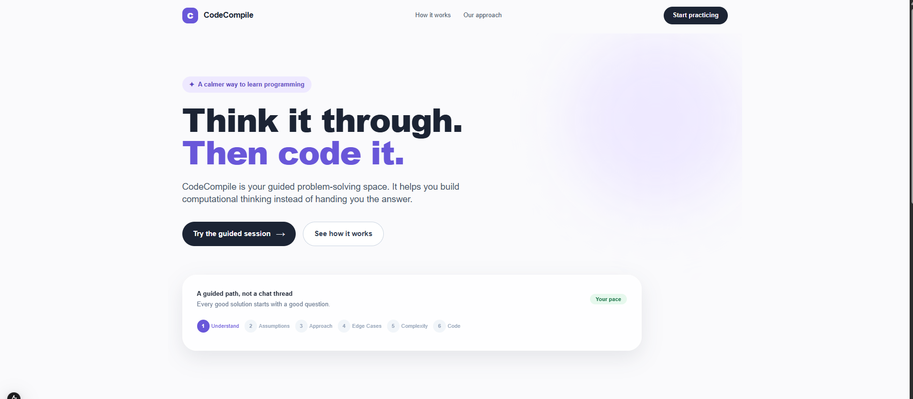
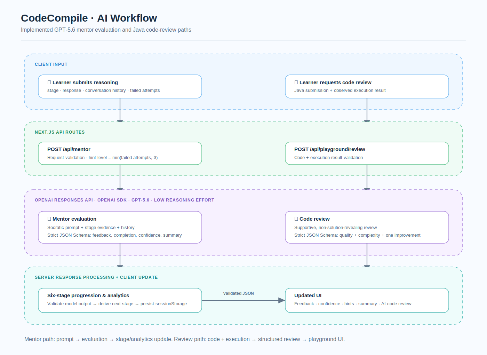
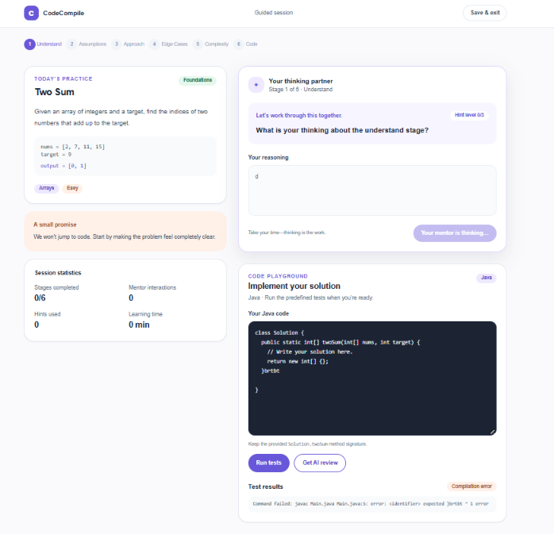
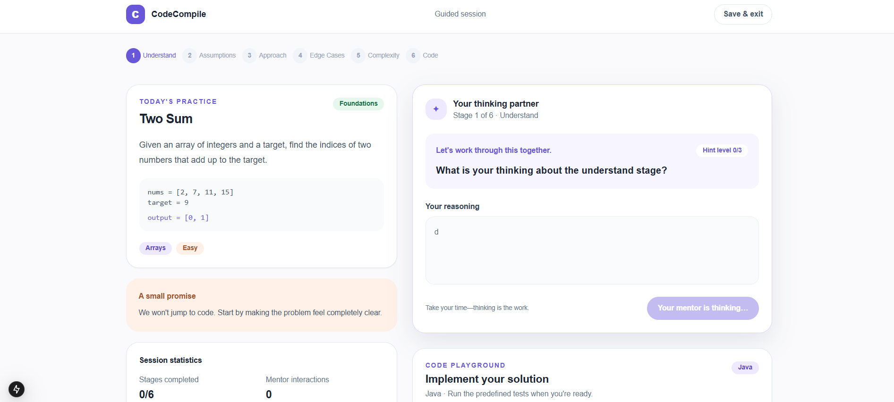
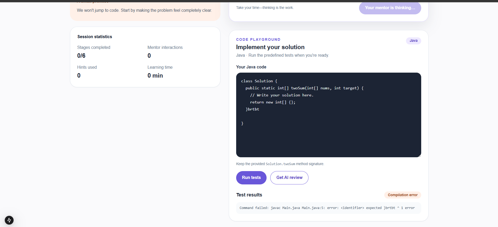

# CodeCompile

> **Think it through. Then code it.** An adaptive, Socratic learning workspace that helps learners build computational-thinking habits before implementation.

[](https://nextjs.org/) [](https://react.dev/) [](https://platform.openai.com/) [](https://www.typescriptlang.org/) [](LICENSE)

## Table of contents

- [Overview](#overview)
- [Features](#features)
- [Tech stack](#tech-stack)
- [Architecture](#architecture)
- [Six-stage learning pipeline](#six-stage-learning-pipeline)
- [AI workflow](#ai-workflow)
- [Project structure](#project-structure)
- [Installation](#installation)
- [Environment variables](#environment-variables)
- [Usage](#usage)
- [Milestones](#milestones)
- [Future improvements](#future-improvements)
- [Repository highlights](#repository-highlights)
- [Acknowledgements](#acknowledgements)
- [License](#license)

## Overview

Many beginners jump straight into code without first developing a clear model of the problem, its constraints, and the trade-offs in a solution. CodeCompile addresses that gap with a guided Two Sum practice session that asks learners to articulate their reasoning before they implement.

The application matters because it treats programming practice as a learning process, not just an answer-generation task. It is aimed at early-stage programmers and learners building foundational problem-solving skills, especially those who benefit from structured prompts and feedback instead of a complete solution.
<p align="center">
  
</p>
<p align="center">
  
</p>
## Features

- A polished landing page that presents the guided-learning approach and links directly to a practice session.
- A fixed, beginner-friendly **Two Sum** exercise with problem statement, example input/output, topic, difficulty, and foundation labels.
- A GPT-5.6-powered Socratic mentor that asks concise guiding questions rather than returning a complete solution or full code.
- A server-controlled, adaptive **six-stage** learning progression.
- Learner-specific feedback: strengths, improvements, encouragement, and a 0–100 confidence score.
- Hint escalation based on incomplete attempts, from a question-only prompt through a small illustrative example (without a complete solution).
- Stage-specific completion criteria, including assumptions, edge cases, complexity, and learner-authored code or pseudocode.
- Conversation history sent to the mentor for contextual evaluation.
- Session persistence in browser `sessionStorage`, including the current stage, conversation, analytics, feedback, and summary.
- Live session analytics: completed stages, mentor interactions, hints used, and elapsed learning time.
- A learning summary on completion of the Code stage: overall confidence, completed stages, biggest strength, area to develop, next topic, and learning summary.
- An in-browser Java code playground with supplied `Solution.twoSum` starter code.
- Four predefined Two Sum tests covering a basic pair, later pair, duplicates, and negative values.
- Java source validation, compilation, execution, result parsing, and per-test pass/fail display.
- Development-time local Java execution with temporary directories, a 3-second timeout, a 64 MB JVM heap, a single active processor, and cleanup after each run.
- Production-ready hook for an isolated Java execution service; local process execution is disabled in production.
- GPT-5.6 AI code review after test execution, covering correctness, logic, edge cases, time complexity, space complexity, and one constructive improvement suggestion.
- Request and response validation on all API routes, including strict structured model outputs for mentoring and review.

## Tech stack

| Area | Implementation |
| --- | --- |
| Frontend | Next.js 15.1.4 App Router, React 19, client components, Tailwind CSS 3 |
| Backend | Next.js Route Handlers on the Node.js runtime |
| AI | OpenAI JavaScript SDK 6.48.0, Responses API, GPT-5.6, low reasoning effort, strict JSON Schema outputs |
| Language | TypeScript 5.7.2, Java for learner submissions |
| Libraries | `openai`, `next`, `react`, `react-dom`, Tailwind CSS, PostCSS, Autoprefixer |
| Runtime | Node.js for the app and route handlers; JDK (`javac` and `java`) for the optional local development runner |
| Deployment | No hosting provider is configured in this repository. Production code execution requires an isolated container/VM service exposed through `EXECUTION_SERVICE_URL`. |

## Architecture

```text
Next.js frontend
  ↓
Next.js API routes (/api/mentor, /api/playground/execute, /api/playground/review)
  ↓
GPT-5.6 and/or Java execution service
  ↓
Mentoring engine and execution-result processing
  ↓
Validated JSON responses
  ↓
Mentor, analytics, playground, review, and summary UI
```

The session page keeps the active stage and analytics in React state. When a learner submits reasoning, the client sends the stage, response, prior conversation, and incomplete-attempt count to `POST /api/mentor`. The server validates the request, derives the hint level, asks GPT-5.6 for a schema-constrained evaluation, validates that evaluation, and derives the next stage from the canonical stage list. The client then updates the feedback, progress, analytics, and browser session storage.

The playground follows a separate path. `POST /api/playground/execute` validates and runs Java locally in development or forwards it to an isolated execution service when configured. Its structured test result can then be sent with the submission to `POST /api/playground/review`, where GPT-5.6 produces a constrained, non-solution-revealing review for the UI.
<p align="center">
  
</p>
## Six-stage learning pipeline

CodeCompile uses exactly six stages. A learner advances only when the server reports that the current stage is complete; otherwise, the learner remains at the same stage and receives a progressively more concrete hint.

| Stage | Learner goal |
| --- | --- |
| 1. Understand | State that the task is to return the indices of two distinct values whose sum equals the target. |
| 2. Assumptions | Identify relevant constraints such as distinct indices, duplicates, negative values, valid/no valid pairs, or output expectations. |
| 3. Approach | Explain a viable strategy and why it can find a valid pair, without implementation details. |
| 4. Edge Cases | Consider meaningful boundary cases such as duplicates, negatives, no solution, or very short arrays. |
| 5. Complexity | Correctly explain the time and space complexity of the proposed approach. |
| 6. Code | Provide learner-authored code or pseudocode that implements the approach and handles stated assumptions. |

## AI workflow

```text
User submits reasoning
  ↓
Server evaluates with GPT-5.6
  ↓
Confidence score generated
  ↓
Hint level updated from incomplete attempts
  ↓
Stage progression determined
  ↓
Learning analytics updated and persisted
  ↓
Session summary generated when the completed Code stage ends the session
```

The mentor is explicitly instructed to avoid complete solutions and complete code. It uses the active stage’s evidence requirement, prior conversation, and hint level to return focused questions, feedback, and a confidence score.
<p align="center">
  
</p>
## Project structure

```text
.
├── app/
│   ├── api/
│   │   ├── mentor/route.ts
│   │   └── playground/
│   │       ├── execute/route.ts
│   │       └── review/route.ts
│   ├── session/page.tsx
│   ├── globals.css
│   ├── layout.tsx
│   └── page.tsx
├── components/
│   ├── code-playground.tsx
│   ├── learning-stage.tsx
│   ├── mentor-card.tsx
│   ├── mentor-feedback.tsx
│   ├── problem-card.tsx
│   ├── session-statistics.tsx
│   ├── session-summary.tsx
│   ├── site-header.tsx
│   └── icons.tsx
├── lib/
│   ├── java-executor.ts
│   ├── learning-session.ts
│   ├── learning-stages.ts
│   └── playground.ts
├── .env.local.example
├── package.json
├── next.config.ts
├── tailwind.config.ts
├── tsconfig.json
└── LICENSE
```

- `app/` contains pages, shared layout/styles, and server route handlers.
- `components/` holds reusable presentation and interactive session components.
- `lib/` centralizes learning-stage rules, session types, playground data, and Java execution.

## Installation

```bash
git clone <repository-url>
cd CodexHackathon_CreateCodeCompile
npm install
```

Create a local environment file from the provided template and add an OpenAI API key:

```bash
cp .env.local.example .env.local
```

On Windows PowerShell:

```powershell
Copy-Item .env.local.example .env.local
```

Run the application locally:

```bash
npm run dev
```

Open [http://localhost:3000](http://localhost:3000). To use the local Java runner, install a JDK and ensure both `java` and `javac` are available on your `PATH`.

## Environment variables

| Variable | Required | Description |
| --- | --- | --- |
| `OPENAI_API_KEY` | Yes for mentoring and AI review | Server-only OpenAI API key used by the mentor and code-review routes. |
| `EXECUTION_SERVICE_URL` | Required for production code execution | URL of an isolated container/VM Java runner. When present, execution requests are forwarded to it. |
| `ALLOW_LOCAL_JAVA_EXECUTION` | Optional in development | Set to `false` to disable local Java execution. It defaults to enabled in development and is ignored in production, where an isolated service is required. |
<p align="center">
  
</p>
<p align="center">
  
</p>
<p align="center">
  
</p>
## Usage

1. Open the landing page and choose **Start practicing** or **Try the guided session**.
2. Read the Two Sum prompt and begin at **Understand**.
3. Enter your reasoning and select **Share my thinking**.
4. Use the mentor’s question, feedback, confidence score, and hint level to refine your response.
5. Continue through Understand, Assumptions, Approach, Edge Cases, Complexity, and Code. Progress is retained for the current browser session.
6. Optionally implement `Solution.twoSum` in the Java playground and select **Run tests**.
7. After execution, select **Get AI review** to receive feedback based on the submission and observed test results.
8. Complete the Code stage to view the session learning summary.

## Milestones

| Milestone | What it introduced |
| --- | --- |
| ✅ Milestone 1 | Repository foundation: the initial README and MIT license. |
| ✅ Milestone 2 | The Next.js learning interface, Two Sum practice view, OpenAI mentor route, OpenAI SDK integration, and GPT-5.6 structured mentor evaluation. |
| ✅ Milestone 3 | Canonical server-enforced six-stage progression and stage-aware mentor evaluation. |
| ✅ Milestone 3.5 | Adaptive hint levels, confidence scoring, learner-specific feedback, session persistence, session analytics, and completion summaries. |
| ✅ Milestone 4 | Interactive Java playground, predefined test execution, local/isolated execution support, and GPT-5.6 AI code review. |

## Future improvements

- Add more problem definitions while retaining the same reusable stage and evaluation contracts.
- Add authenticated, durable learner profiles instead of browser-session-only persistence.
- Add a production execution-service implementation and operational monitoring around it.
- Expand test cases and support additional languages through isolated runners.
- Add automated tests for API validation, stage progression, and Java execution behavior.

## Repository highlights

CodeCompile separates the learner-facing interface, API boundaries, mentoring rules, and execution logic into small modules. The canonical stage array lives in one place, and the server—not the browser—derives the next stage, which keeps adaptive progression trustworthy as the UI evolves.

The AI evaluation pipeline is deliberately structured: each GPT-5.6 response is constrained by a JSON Schema and checked again before being returned. That design gives reusable components predictable data for confidence, feedback, analytics, review, and summaries. The playground is similarly modular: its test definitions, execution contract, and runner are independent, so a production isolated service can replace local execution without changing the UI.

This clean API design supports scalability: Next.js route handlers can remain stateless, client session state is kept in browser storage, and execution can be moved behind `EXECUTION_SERVICE_URL` to an isolated container or VM service. The Socratic, hint-escalating mentor is an intentional product decision that keeps the learner’s reasoning at the center of the experience.

## Acknowledgements

- [OpenAI Codex](https://openai.com/codex/) and [GPT-5.6](https://platform.openai.com/)
- [Next.js](https://nextjs.org/), [React](https://react.dev/), and [TypeScript](https://www.typescriptlang.org/)
- [Tailwind CSS](https://tailwindcss.com/), [PostCSS](https://postcss.org/), and [Autoprefixer](https://github.com/postcss/autoprefixer)
- The [OpenAI JavaScript SDK](https://github.com/openai/openai-node)

## License

MIT — see [LICENSE](LICENSE). This is a placeholder declaration for the project submission.
